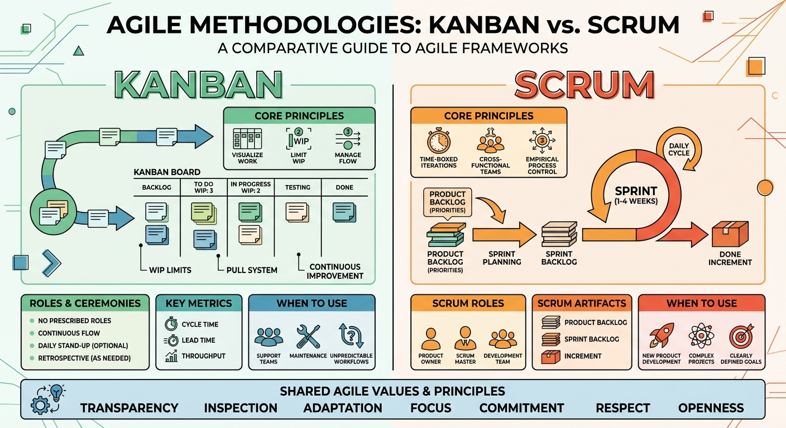

# Agile Methodologies — Kanban & Scrum

This document introduces the two agile methodologies used as reference for organizing the team's work on the Loan Management System (LMS) project: **Kanban** and **Scrum**.

## 1. Kanban

### What it is
Kanban is a visual, flow-based method for managing work. It focuses on visualizing the workflow, limiting how much work is in progress at any time, and continuously improving the process — without fixed-length iterations or prescribed roles.

### How it works
- **Kanban board:** work items move through visual columns that represent the workflow stages (e.g., *To Do → In Progress → Review → Done*).
- **Work In Progress (WIP) limits:** each column has a maximum number of items allowed, which prevents overloading the team and exposes bottlenecks.
- **Pull system:** team members pull the next item only when they have capacity, instead of work being pushed onto them.
- **Continuous flow:** there are no fixed sprints; items are delivered as soon as they are done, and new work can be added to the backlog at any time.
- **Continuous improvement:** the team regularly reviews cycle time and bottlenecks to adjust WIP limits and policies.

## 2. Scrum

### What it is
Scrum is an iterative framework that organizes work into fixed-length cycles called **sprints**, with defined roles, events, and artifacts that create structure and regular checkpoints for inspection and adaptation.

### How it works
- **Roles:**
  - *Product Owner:* owns and prioritizes the Product Backlog.
  - *Scrum Master:* facilitates the process and removes impediments.
  - *Development Team:* builds the increment during the sprint.
- **Artifacts:**
  - *Product Backlog:* the full, prioritized list of work for the product.
  - *Sprint Backlog:* the subset of items selected for the current sprint.
  - *Increment:* the working piece of software delivered at the end of the sprint.
- **Events:**
  - *Sprint Planning:* the team selects and plans the work for the upcoming sprint.
  - *Daily Scrum:* a short daily sync to track progress and surface blockers.
  - *Sprint Review:* the increment is demonstrated to stakeholders for feedback.
  - *Sprint Retrospective:* the team reflects on the sprint and identifies process improvements.
- **Fixed-length sprints:** typically 1–4 weeks, after which a new sprint begins.

## 3. Summary

| Aspect | Kanban | Scrum |
|---|---|---|
| Iterations | Continuous flow, no fixed cycles | Fixed-length sprints |
| Roles | No prescribed roles | Product Owner, Scrum Master, Development Team |
| Planning | Ongoing, pull-based | Sprint Planning at the start of each sprint |
| Change | Can be added to the backlog anytime | Scope is locked for the duration of the sprint |
| Core control | WIP limits | Sprint commitment and defined events |
