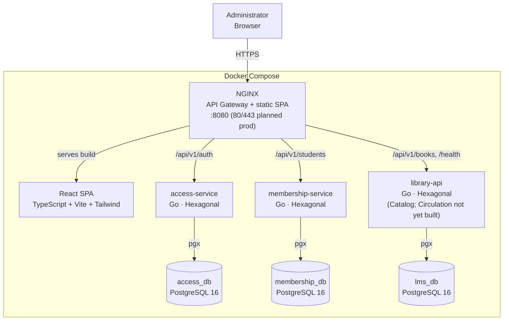

# Technology Stack — LMS-LIBRARY-V1

> Deliverable for the "Technology Stack Selection" issue: the research behind each choice, the
> final stack, and the technology architecture diagram. This consolidates and cross-references
> the decisions already recorded in `01-context/overview.md` and the ADRs in
> `05-architecture/decisions/records/` — if this file and an ADR ever disagree, the ADR wins.

---

## 1. Research

### 1.1 Frontend alternatives (≥ 2 compared)

| Option | Language | Pros | Cons |
|--------|----------|------|------|
| **React (chosen)** | TypeScript/JavaScript | Largest ecosystem and hiring pool; the team already has exposure to it; pairs naturally with a REST backend via a simple HTTP client; Vite gives a fast, minimal-config dev loop | JSX/hooks have a learning curve for state-heavy screens; no built-in router/state management (added separately — React Router) |
| Vue 3 | JavaScript/TypeScript | Gentler learning curve, single-file components, good docs | Smaller ecosystem than React for component libraries; no team experience with it, so it would cost ramp-up time this project's timeline doesn't have |
| Angular | TypeScript | Batteries-included (router, forms, HTTP client built in), strong typing by default | Heaviest of the three for a single-admin panel with ~8 screens; steeper learning curve; more boilerplate than this project's scope justifies |

**Chosen:** React 19 + TypeScript + Vite + Tailwind CSS.

### 1.2 Backend alternatives (≥ 2 compared)

| Option | Language | Pros | Cons |
|--------|----------|------|------|
| **Go (chosen)** | Go | Compiles to a single static binary — trivial to containerize; strong typing catches errors at compile time; native concurrency; the team explicitly wants hands-on Go experience (`01-context/overview.md`) | Smaller web-framework ecosystem than Node/Python; more verbose error handling (explicit `if err != nil`) |
| Node.js (Express/NestJS) | JavaScript/TypeScript | Same language as the frontend (one language for the whole team); huge package ecosystem | Weaker compile-time safety without extra tooling; the team specifically wanted to learn a second, statically-typed backend language rather than reuse JS on both ends |
| Python (FastAPI) | Python | Fast to prototype, good typing support via Pydantic, easy to read | Weaker raw performance and concurrency story than Go for a service handling many short-lived HTTP requests; no team push to use Python for this project |

**Chosen:** Go 1.25, Hexagonal Architecture (Ports & Adapters) per module — see
`05-architecture/decisions/records/ADR-002-hexagonal-modular-monolith.md`.

### 1.3 Database: relational vs. non-relational

| Option | Pros | Cons |
|--------|------|------|
| **PostgreSQL (relational, chosen)** | ACID transactions — required so a loan's availability decrement and the loan row insert commit atomically; native foreign keys enforce `Loan → Student`/`Loan → Book` referential integrity for free; the domain is inherently relational (a fixed, well-known set of entities and relationships, not a flexible/document-shaped one) | Schema changes need migrations (mitigated: `golang-migrate`, versioned in `06-data/migration-strategy.md`) |
| MongoDB (document, non-relational) | Flexible schema, fast to start without upfront modeling | No native multi-table transactional integrity as strong as Postgres for the availability-counter + loan-row invariant this project depends on (`02-domain/entities-and-rules.md`, INV-001 on Book); the data here is not document-shaped — it's a small, fixed relational graph |

**Chosen:** PostgreSQL 16, one instance per extracted service (`access_db`, `membership_db`; a
shared `lms_db` for the contexts not yet extracted — see `ADR-004`).

### 1.4 Compatibility review against project requirements

| Requirement | Stack element that satisfies it |
|---|---|
| ACID guarantees for availability counters and loan state (`04-requirements/non-functional.md`) | PostgreSQL |
| JWT-based single-admin auth, no self-registration (`02-domain/domain-map.md`) | Go `golang-jwt` + `bcrypt`, implemented once in `access-service` |
| Containerized local + cloud/virtualized deployment (`01-context/scope.md`, Constraints) | Docker / Docker Compose for every service |
| Single entry point, TLS termination, static SPA hosting (`ADR-003`) | NGINX |
| No budget for managed infrastructure (`01-context/scope.md`, Constraints) | Every chosen tool is free/open-source; no paid SaaS dependency |

---

## 2. Final stack

| Layer | Technology | Tooling |
|-------|-----------|---------|
| **Frontend** | React 19 + TypeScript, Vite (build), Tailwind CSS (styling), React Router (routing), axios (HTTP client) | `npm`, ESLint/oxlint |
| **Backend** | Go 1.25, Hexagonal Architecture, `chi` (router), `golang-jwt` + `bcrypt` (auth), `zap` (structured logging) | `go test`, `golangci-lint`, `go build` |
| **Database** | PostgreSQL 16, `pgx` driver, `golang-migrate` for versioned schema migrations | `psql`, migration files in `backend/migrations/` per service |
| **Reverse proxy / API Gateway** | NGINX — TLS termination, static SPA hosting, path-based routing to each service | `infra/nginx/nginx.conf`, versioned in Git |
| **Infrastructure** | Docker, Docker Compose (local + cloud/virtualized target) | `docker compose up --build` |
| **Version control / CI** | Git, GitHub — Conventional Commits, PR-based `feat/HU-XX-...` branches into `dev` | `.github/PULL_REQUEST_TEMPLATE.md`, `.github/ISSUE_TEMPLATE/` |

---

## 3. Justification (technical + team criteria)

- **Team fit:** the team explicitly wanted hands-on Go experience for the backend, already knew
  React for the frontend, and none of the alternatives offered a comparable learning outcome
  within a single academic term (`01-context/overview.md`).
- **Scope fit:** every tool is free, container-friendly, and runs comfortably on a laptop or a
  small cloud VM — matching the "no monetary budget" constraint (`01-context/scope.md`).
- **Domain fit:** the domain is a small, well-understood relational graph (Administrator,
  Student, Book, Loan) with hard consistency requirements on availability counters — exactly
  what a relational database with ACID transactions is for, not a document store.
- **Architecture fit:** Hexagonal Architecture per Go module made the later incremental
  microservices split (`ADR-004`) a low-risk lift-and-shift instead of a rewrite — validating
  the backend framework/pattern choice in hindsight, not just in theory.

---

## 4. Technology architecture diagram

> This is the current, hybrid (part-microservices, part-monolith) topology — see `ADR-004` for
> why, and `09-microservices/service-catalog.md` for the live, most-detailed version of this
> diagram (kept in sync as further contexts are extracted).

---

## 5. Team validation

Every technology decision above is formalized as an ADR with the whole team listed as
author/reviewers, following `00-governance/git-conventions.md`'s review process — not just this
summary document:

| Decision | ADR |
|---|---|
| Documentation/code language (English) | `ADR-001-idioma-documentacion.md` |
| Backend architecture (Hexagonal, modular monolith at first) | `ADR-002-hexagonal-modular-monolith.md` |
| NGINX as reverse proxy / API gateway | `ADR-003-nginx-reverse-proxy.md` |
| Incremental microservices decomposition | `ADR-004-incremental-microservices-decomposition.md` |

Authors/Reviewers on every ADR: Oscar Areiza (Tech Lead), Hermes Pascuas, Luis Alejandro
Meneses (Development team) — see `05-architecture/decisions/README.md` for the full register.

---

## Acceptance criteria checklist (Technology Stack issue)

- [x] Full stack documented (frontend + backend + DB + tools) — Section 2
- [x] Technical justification included per choice — Sections 1, 3
- [x] Architecture diagram visible in the docs repo — Section 4
- [x] The whole team knows and validates the chosen stack — Section 5 (ADR authorship/review)

## Correlations

- System overview and stack summary → `01-context/overview.md`
- Architectural decisions (full detail) → `05-architecture/decisions/records/`
- Live, most-detailed service topology → `09-microservices/service-catalog.md`
- Data model this stack persists → `06-data/models.md`
- Discovery deliverable this builds on → [`discovery.md`](discovery.md)
